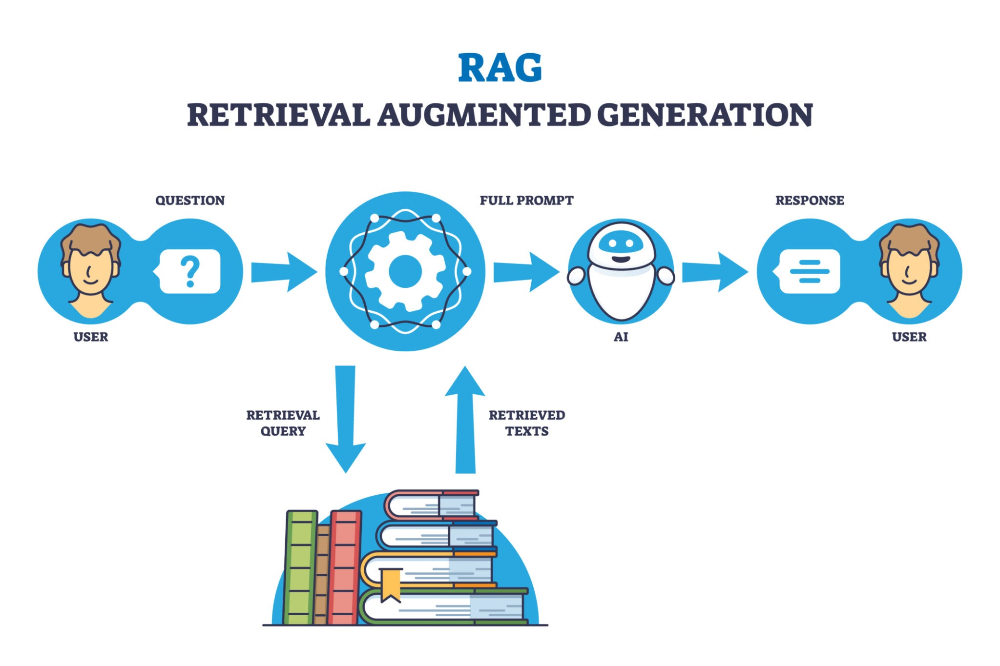

# LangChain

LangChainは、大規模言語モデル（LLM）を利用したアプリケーションを開発するためのフレームワークです。LLMの能力を最大限に引き出し、より複雑で実用的なアプリケーションを簡単に構築するために利用されます。



```sh
export OPENAI_API_KEY=
```

## Parlant

Parlantは、LLMエージェントの振る舞いを精密に制御するための制御層（コントロールレイヤー）です。これに対し、LangChainはLLMアプリケーションを構築するためのフレームワーク

予測不能なLLMの振る舞い（ハルシネーションなど）を防ぎ、ビジネスルールに準拠した一貫性のある応答を保証できる

